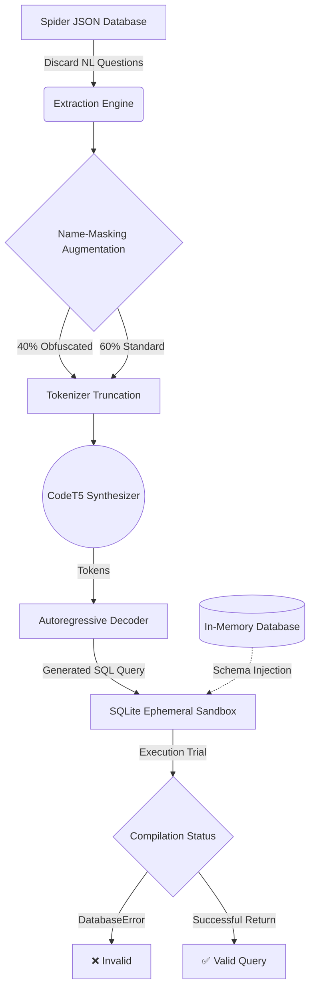
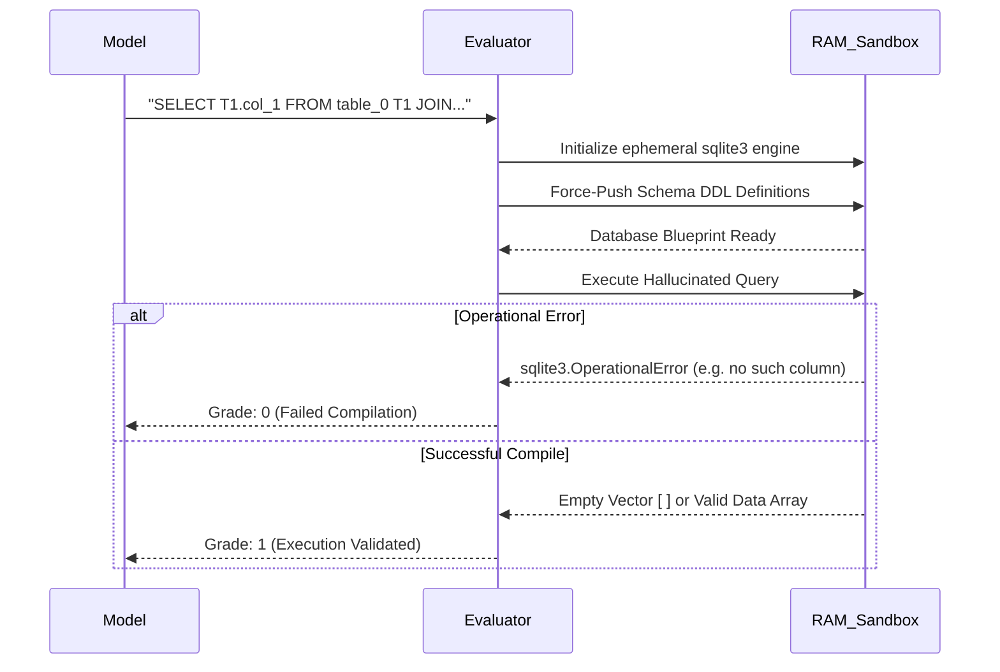

# 🧠 Pipeline Architecture: Unconditional Schema-to-SQL Generation

Welcome to the cutting-edge of automated database engineering. Most NLP models treat SQL generation as a simple translation task: *Language in ➔ SQL out*.

This repository **re-frames the problem.** We built an **Unconditional SQL Synthesis Engine**. Given absolutely nothing but the structural blueprints of a database (the `CREATE TABLE` schemas), this model autonomously hallucinates batches of diverse, perfectly executable SQL queries.

It doesn’t translate. It *invents*.

---

## 🏗️ High-Level System Architecture

How do you teach a machine to dream in SQL? You rip out its English constraints, feed it raw database scaffolding, and rigorously score it in an ephemeral sandbox.



---

## 1. Data Hijacking & Preprocessing (`preprocess.py`)

The original [Spider Dataset](https://yale-lily.github.io/spider) is massive but deeply coupled to Natural Language questions. To create an unconditional generator, we had to "hijack" the dataset. 

Instead of teaching the model to map English nouns to SQL tables, we fundamentally force it to map **topological edges** (`FOREIGN KEY`, `PRIMARY KEY`) into Relational Algebra (`JOIN`, `GROUP BY`).

### The Regularization Problem (Name-Masking)

Pre-trained Language Models (PLMs) are notoriously lazy. If they see a table named `employees` and a table named `salaries`, they will guess how to `JOIN` them based on pre-trained English context rather than reading the explicit `REFERENCES` syntax in your schema.

**Our Solution: 40% Name-Masking Ablation.**
We randomly select 40% of our training batches and programmatically obliterate all English semantics before passing them to the model.

```diff
- CREATE TABLE departmental_head (head_id PRIMARY KEY, name text)
+ CREATE TABLE table_0 (col_0 PRIMARY KEY, col_1 text)
```

**Why is this brilliant?** The model isn't allowed to cheat by knowing what an "employee" is. It is forced to mathematically trace `col_0` through the database to figure out valid query syntax. This vastly improves its zero-shot performance on entirely unseen database concepts.

### Token-Aware Truncation
Transformers have rigid memory limits. CodeT5 hard-caps at **1024 tokens**. Many enterprise databases far exceed this limit.
*   **The Naïve Way:** Chop the string at 1024 characters. This violently slices `CREATE TABLE` blocks in half, corrupting the Abstract Syntax Tree (AST).
*   **Our Way:** We deploy an iterative **Table-Boundary Truncation algorithm**. We use the actual Huggingface model tokenizer to count subsets of schemas, appending whole tables until we are just under the 1024 budget. Only pristine, contiguous schema chunks are fed to the model.

---

## 2. Model Architecture & Hyperparameters (`train.py`)

We selected **`Salesforce/codet5-base`** (220M parameters). Standard PLMs like T5 or BART are tuned to denoise English blocks. CodeT5 is explicitly pre-trained on *Identifier-Aware Denoising*, making it a savant at tracking complex variables (like nested `table.column_id` pointers) across hundreds of lines of code.

### The Optimization Calculus

| Hyperparameter | Value | The "Why?" |
| :--- | :--- | :--- |
| **Epoch Limit** | `5` | Schema abstractions overfit rapidly. 5 epochs with a patience-based Early Stopping loop prevents the model from memorizing the specific tables. |
| **Learning Rate** | `5e-5` | Using standard neural network LRs (like `1e-3`) causes **Catastrophic Forgetting**, where the model violently overwrites the geometric code representation it spent millions of computation hours learning during pre-training. |
| **Warmup Ratio** | `0.10` | Enforces a 10% gradual learning rate scale-up to protect pre-trained weights from aggressive, errant gradient updates on the very first batch. |
| **Effective Batch** | `16` | Achieved via `Gradient Accumulation = 2` on `Batch Size = 8`. This smooths the gradient trajectory mathematically without triggering consumer-grade GPU Out-Of-Memory (OOM) halts. |

---

## 3. Evaluation: The Virtual Sandbox (`evaluate.py`)

In traditional NLP, a model is scored using **Exact Match**. If it guesses exactly what the human wrote, it gets a point.

**The Paradigm Shift:** Since our model is unconditionally dreaming up queries out of thin air, there is no "ground truth" to compare against. The model might hallucinate a brilliant, highly complex 3-level `JOIN` query that technically works perfectly, but would fail standard NLP tests because it didn't "match the answer key".

We built a custom **Generative Robustness Paradigm** that evaluates execution compiling instead of semantic string matching:



### The Test Protocol
1.  **Ephemeral Sandboxing:** A clean `sqlite3` database engine is spawned entirely in your system RAM.
2.  **State Injection:** The exact structure of the database (DDL blueprints) is forcefully executed into the sandbox.
3.  **The Compilation Trial:** The model's hallucinated query is piped through the SQLite instance. 
4.  **Grading Logistics:** If it crashes (e.g., hallucinated columns, fractured syntax string, illegal grouping semantics), the model organically fails. If the query safely executes and returns data (even an empty array, since there are no rows yet), the syntax and structural joins are proven completely viable. **Pass.**

*(We also implement a secondary **Diversity Scoring** algorithm inside `evaluate.py`, indexing well over 19 distinct Relational Algebra commands like `MIN`, `MAX`, `INTERSECT` to mathematically ensure the model isn't just generating identically cheap `SELECT *` queries down its generation beam).*

---

### 💡 The End Result
By architecting a synergy between strict topological truncation, aggressive semantic name-masking ablations, identifier-aware Transformer pre-training, and rigorous compile-time execution scoring, we bridge the gap between static semantic parsers and highly dynamic, fully autonomous database intelligence systems.
